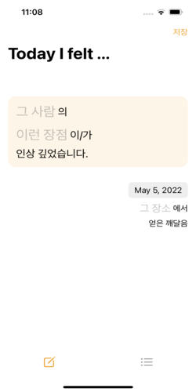
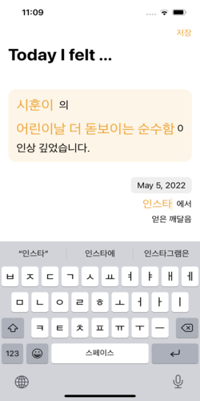
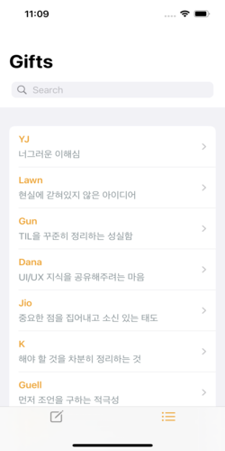
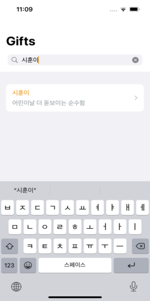
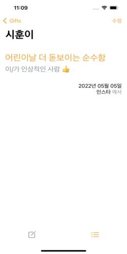
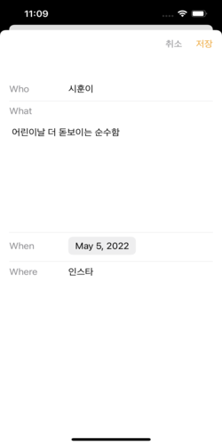

# :iphone: TIF: Today I Felt

지식은 책과 여러 자료로 부터 배우지만, `지혜`는 사람으로부터 배웁니다.

다른 사람의 `장점`에 주목하고 반만이라도 따라가려 노력하면 자신도 더 좋은 사람이 되지 않을까요.

1. 매일 공부한 것을 TIL(Today I Learned)로 정리하는 것처럼, 다른 사람으로부터 깨달은 것을 `TIF(Today I Felt)`로 기록해두세요.

2. 더 나은 세상을 만드는 데 가장 작지만 강력한 방법은 `칭찬`이라고 생각합니다. 기회가 될 때마다 기록해둔 장점을 자연스럽게 전해주세요.

좋은 개발자를 넘어 `좋은 사람`으로 좋은 인생을 살아가고 싶습니다.

## :pushpin: Features

- Fit in iPhone 13
- Users can save, search, delete, and edit some data

## :people_hugging: Author

- 남이찬(ICHAN NAM)
- English: Timo Nam
- [LinkedIn](https://www.linkedin.com/in/timo-nam/)
- [GitHub 1](https://github.com/timo-nam)
- [GitHub 2](https://github.com/ad20op25wj)
- [기술 블로그](https://dev-timo.tistory.com)
- [일상 블로그](https://blog.naver.com/ad20op25wj)

## :framed_picture: Demo

[Demo](https://drive.google.com/file/d/1Z_fYUH-_L_VzoJPpSIPe2NAIWP9j-I7p/view?usp=sharing)

## :fireworks: Screenshots

## :sparkles: Skills & Tech Stack

- `SwiftUI`
- `UIKit`
- `CoreData`
